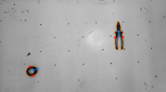

# U2Net para Picking

[Documentación en Github Pages](https://laboratorio-de-robotica.github.io/Picking-U2Net/)

Detección de puntos de agarre usando U2Net para segmentar objetos desconocidos, y análisis de componentes principales para determinar los puntos de agarre.

[Repositorio de U2Net](https://github.com/xuebinqin/U-2-Net)