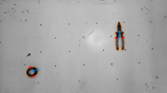
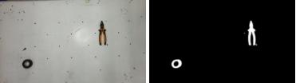
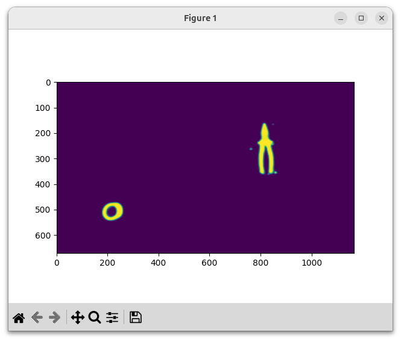

# U2Net para Picking

Picking requiere un sensor que informe al robot las coordenadas donde tomar la pieza.  Un sistema de visión artificial se puede programar a medida de cada tipo de pieza.  Este proyecto adopta U2Net para reconocer cualquier pieza, incluso piezas nunca vistas (aquéllas que no formaron parte del entrenamiento del modelo).

El presente sistema de detección de piezas se orienta al *antipodal grasping*, robots con grippers de dos dedos, y determina sobre la imagen los dos puntos por donde se debe tomar la pieza, anotados con círculos rojos.

Este proyecto no es un sistema completo de picking, sólo implementa la determinación de los puntos de agarre sobre la imagen.  Para una demo completa sobre el robot se necesita también:

- transformación de coordenadas, de píxeles al sistema de referencia del robot
- implementación del servidor de coordenadas en una PC
- programación del robot para obtener las coordenadas y proceder al picking

# U2Net

U2Net es un modelo de deep learning de la categoría SOD (Salient Object Detection), que produce una imagen monocromática segmentando los objetos para separarlos del fondo.

El [repositorio de U2Net](https://github.com/xuebinqin/U-2-Net) proporciona dos modelos entrenados:

- u2net, de 176 Mb
- u2netp, de 4,7 Mb, más liviano, rápido y menos preciso

# Picking
El sistema binariza la segmentación de U2Net, releva contornos y realiza un análisis geométrico a partir de momentos para determinar los puntos de agarre.

El sistema sólo considera contornos externos y tiene mucho espacio para la mejora considerando contornos internos o la estabilidad de punto de agarre.

# Instalación
Clonar el repositorio e instalar las dependencias, usualmente en un entorno virtual.

    git clone 

# Dependencias

Esencialmente las dependencias de U2Net; para cada una se muestras dos versiones: las sugeridas por el sitio de U2Net y las usadas en este desarrollo.  Es muy posible que funciones con versiones futuras.

- Python 3.6, 3.12
- numpy 1.15.2, 1.26.4
- scikit-image 0.14.0, 0.22.0
- python-opencv 4.10
- PyTorch 0.4.0
- torchvision 0.2.1

Este proyecto se probó exitosamente con la última versión de Torch a inicios de 2025.

*Nota: scikit-image se usa solamente en u2net_predict.py para la función resize().  Se podría evitar esta biblioteca reemplazando por cv2.resize().*

# Demo

## u2Net predict

    python3 u2net_predict_demo.py --help
    python3 u2net_predict_demo.py

Procesa un archivo de imagen y muestra la segmentación de u2net.  Permite elegir entre los modelos u2net y u2netp.

## Picking

    python3 picking.py --help
    python3 picking.py

Picking también procesa una imagen y determina los puntos de agarre.  Usa u2net_predict como primer paso.

# Estructura del código

- model: carpeta con los modelos u2net y u2netp
  - u2net.py
    - dnn con torch, para u2net y u2netp
  - u2net.pth y u2netp.pth
    - ponderaciones torch de los modelos entrenados
- u2net_predict.py
  - biblioteca para predicción (no para entrenamiento), que normaliza la entrada y la salida
  - define la clase **U2netModel**, en cuyo constructor se elige el modelo u2net o u2netp
  - importa u2net
- u2net_predict_demo.py
  - breve demo que lee parámetros de línea de comando, abre una imagen y la segmenta con **U2NetModel**
  - importa u2net_predict
- pick.py
  - segmenta la imagen
  - obtiene los contornos
  - los analiza con momentos
  - determina puntos de agarre
  - los anota para visualización
  - importa u2net_predict

# Uso en un sistema de picking

El uso dentro de un sistema requiere sólo:

- model
- u2net_predict.py
- pick.py

La integración al sistema se hace adoptando pick.py como biblioteca:

    import PickU2Net from pick

Al final de pick.py se encuentra el código main que ejemplifica el uso de la clase PickU2Net, que se puede resumir en tre pasos:

    picking = PickU2Net(model_name)
    results = picking(input_image)
    imVis = picking.annotate(input_image)

El primer paso se hace una sola vez al inicio.

El segundo paso se repite sobre cada imagen, y se obtienen los resultados buscados: los puntos de agarre.

results es un array de objetos (o None) con estas propiedades:

- center
- principalComponent
- grabbingPoint0
- grabbingPoint1
- contour

El último paso es opcional, obtiene una imagen anotada.